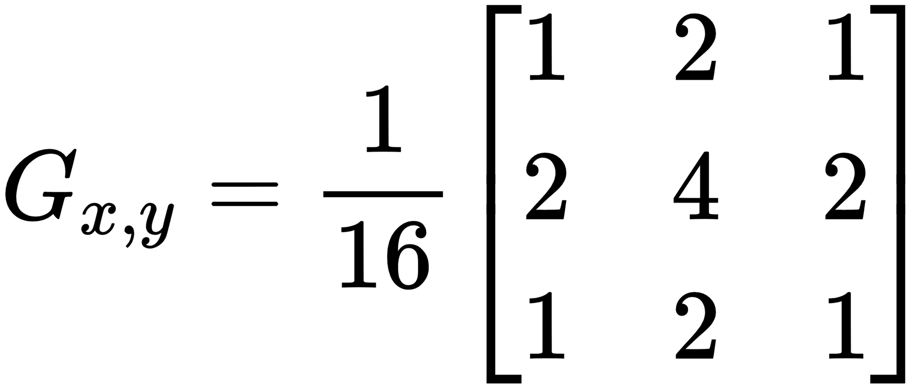
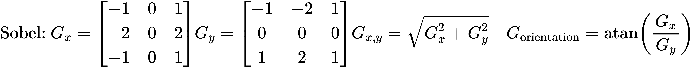
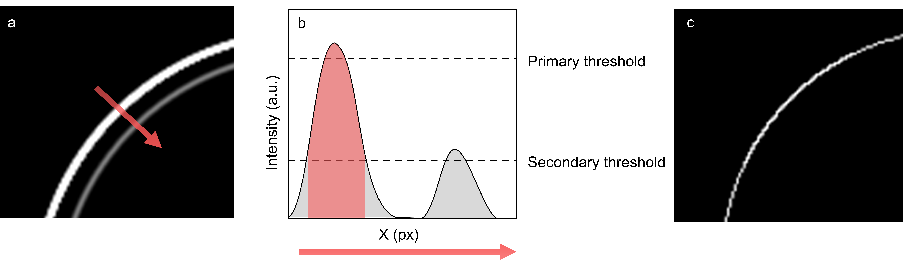
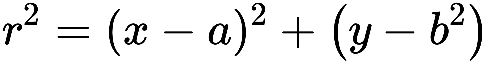
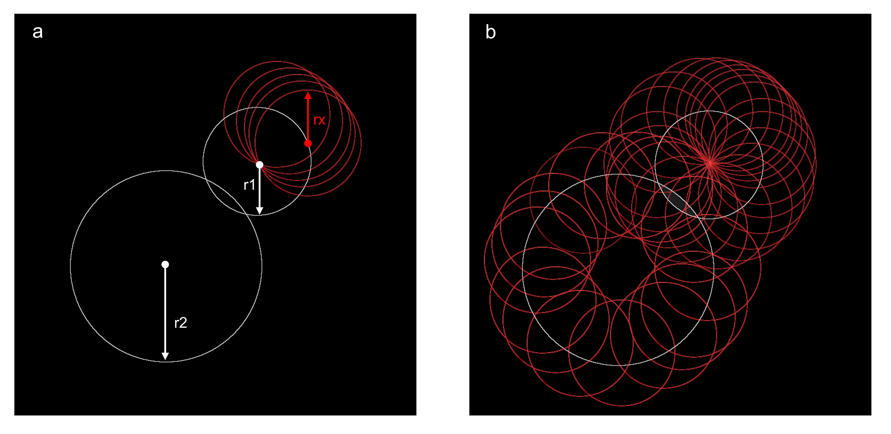

<h1> Hough Scan </h1> 

Application for detection and data extraction of circular objects, such as emulsion droplets, from microscopy images
  

  
<h3> Contents </h3>
<ul> 
  <li><a href="#Installation"> Installation (Developer Build)
  <li><a href="#Dependencies"> Dependencies
  <li><a href="#User Guide"> User Guide
  <li><a href="#Planned Updates"> Planned Updates
  <li><a href="#Theory"> Theory
  <li><a href=""> Changelog
    </ul>
  
  
<h2><a name="Installation"> Installation (Developer Build)</a></h2>
 

<h3> linux (Ubuntu) </h3>
<ul>
   <li>Install dependencies. 
   <li>Navigate to Hough-Scan directory in terminal and run:
   <code> Python houghscan.py </code>
</ul>

<h3> Windows </h3>
 
 
  Hough Scan is created using GTK3+, the easiest way to run it on windows currrently is via WSL (below). 

<ul>
  <li> Install WSL and linux distro of your choice. Guide: https://wiki.ubuntu.com/WSL  
  GUI support is comming in a future update (https://devblogs.microsoft.com/commandline/the-windows-subsystem-for-linux-build-2020-summary/#wsl-gui)
  but for now you will need to enable support via X server. (in more detail at https://wiki.ubuntu.com/WSL) 
  <li> Follow linux installation instructions.

  <li> Navigate to Hough-Scan directory in terminal and run
  <code> Python houghscan.py </code>
</ul>

<h2><a name="Dependencies"> Dependencies </a></h2>
<li> Matplotlib 
  <code> pip install matplotlib </code>
<li> Numpy
  <code> pip install numpy </code>
<li> Scipy
  <code>pip install scipy </code>
<li> OpenCV
  <code>pip install opencv-python</code>
  
<h2><a name="User Guide"> User Guide </a></h2>

<ul>
  <li> Step 1: Run the program
  <li> Step 2: Open an image
  <li> Step 3: Set the tile size depending on how densely populated with circles your image is. Make sure that the 'number of tiles' X 'size of tiles' is greater than the image size
  <li> step 4: click an area of interest on the image and set the parameters on the right hand side. Start with 'Hough Threshold' and 'Canny Upper' at a higher value (60+) if you have a complex image.
  <li> Step 5: Click run. (results may take some time) 
  <li> Step 6: Press the icons adjacent to the run button to get a histogram and list of data
  <li> Step 7 (optional): Add additional runs by pressing the + or - button
</ul>

<h2><a name="Planned Updates"> Planned Updates </a></h2>

<h2><a name="Recent Changes"> Recent Changes </a></h2>
<ul>
  <li> Executable version
  <li> Export as JSON file 
  <li> Tile by percentage overlap
  <li> Sepparate tile sizes for different runs
</ul>

<h2><a name="Theory"> Theory </a></h2>

 For more information on the image manipulation processes, please visit https://opencv.org/ . Below we have summarised the some of the processes performed by the OpenCV library in order to give the user a better idea what each of the paramters used in this software do. 

  
  
  

  Hough Scan uses the following techniques to process an image: greyscale conversion, blur, sobel operation and canny edge detection followed by the circle hough transform.
  

<h3> Kernel Convolution </h3>

 Blur and Sobel are both kernel convolition processes. For each pixel in the image (red square) the neighbouring pixels (green square) are added using a weighting which is determined by the kernel (3x3 matrix - greek letters in this case). The output is then often normalised. The "Blur" parameter adjusts the number of pixels used in blurring 

 

<h3> Sobel Operation </h3>

 The Sobel operation is an example of a kernel convolution process used for edge detection. It is applied in both the x and y direction independently and allows the calculation of angular informatio as shown by the below figure. This information is then used in the next process - canny edge detection. 

 

<h3> Canny Edge Detection </h3>

 Canny edge detection uses two thresholds (primary and secondary). A line is drawn in the direction of the 'edge' values above the primary threshold are retained and values below are removed. If however, a value is below the primary theshold but above the secondary threshold <b> and </b> is also connected to a point above the primary threshold by pixel tracing (i.e. without dipping below the secondary threshold) the value is retained. The "Canny Upper" parameter sets the primary threshold and the secondary threshold is automatically set.
 
 

<h3> Circle Hough Transform </h3> 

 At this stage the image has been refined to a set of thin white lines/circles on a black background. The circle Hough-tansform will scan across the image until it finds a white pixel. For each pixel it will draw a circle of radius r (where r is an ever-increasing value upon each pass of the image and is set between two limits) is drawn using the equation for a circle.

 

 

 the circles are added to an 'accumulator image'. If the radii of the drawn circles match the radii of circles in the image, a bright spot will be seen indicating the center of the circle. The "Hough Threshold" parameter is used to determine at which value a bright spot is conscidered a true center of a circle. The "Min distance" parameter will set a minimum distance between circle centers, the "Min and Max Radius" will determine the valuse of r that are conscidered.

  

  
 <h3> Tiling </h3> 
 
 due to the complexity of many microscopy images (with i.e. more than 100 circular objects) it is convinient to tile the images, allowing for rendundacy at the boundary by removing dupicate coordinates. The size of tiles used, the overlap and the distance to remove duplicates may be altered using the "Tile Size, Overlap and Doubles Removal Dist." parameters.

<h2><a name="Changelog"> Changelog </a></h2>
<ul>
  <li> 8JUL20: uploaded early dev build
</ul>
