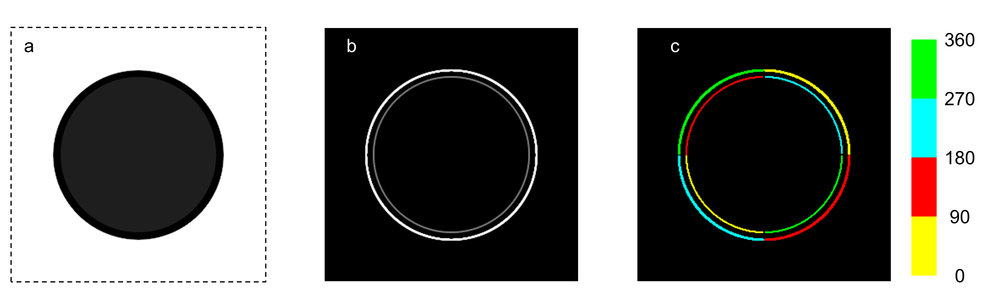

<h1> Hough Scan </h1>

Application for detection and data extraction of circular objects, such as emulstion droplets, from microscopy images
  

  
<h3> Contenets </h3>
<ul> 
  <li><a href=""> Installation
  <li><a href=""> Dependencies
  <li><a href=""> User Guide
  <li><a href="#Theory"> Theory
  
  
     
  

<h2><a name="Theory"> Theory </a></h2>
  

Hough Scan uses the following processes on an image
  

