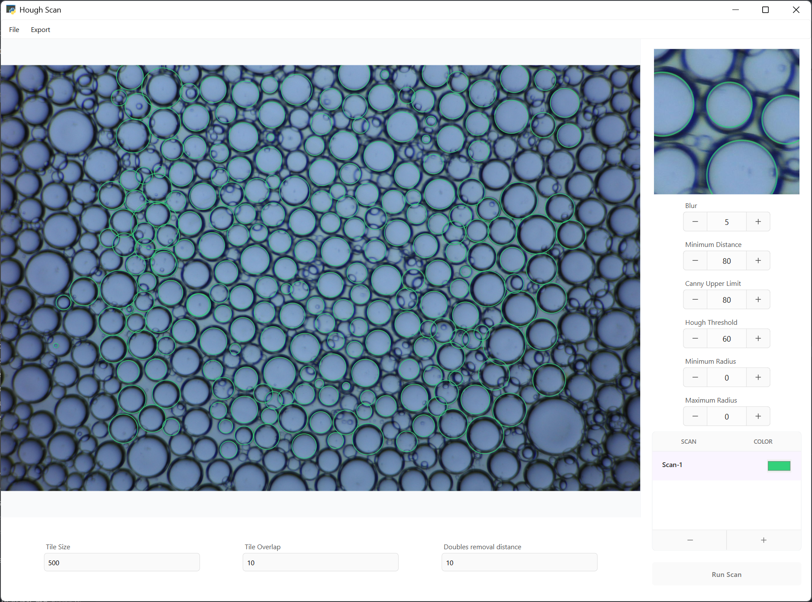
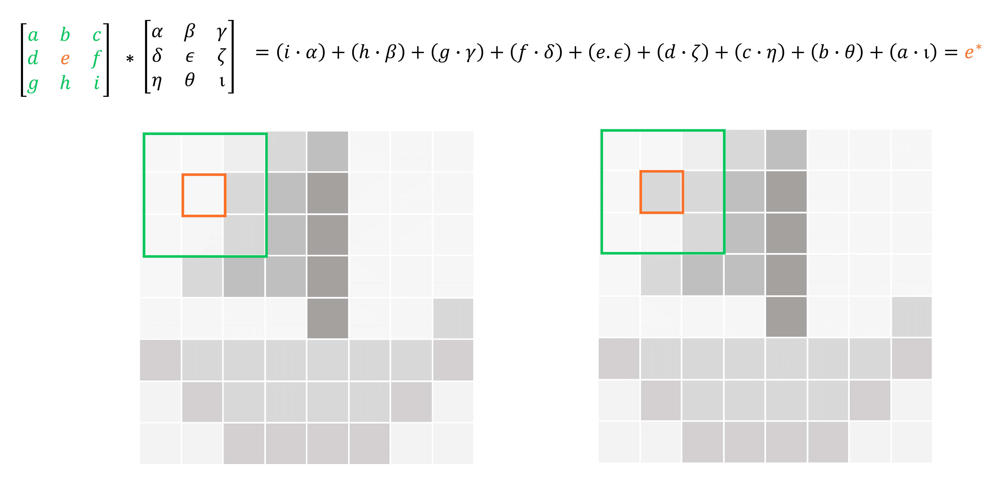

<h1> Hough Scan </h1> 

Application for detection and data extraction of circular objects, such as emulsion droplets, from microscopy images
  

  
<h3> Contenets </h3>
<ul> 
  <li><a href="#Installation"> Installation (Developer Build)
  <li><a href="#Dependencies"> Dependencies
  <li><a href="#User Guide"> User Guide
  <li><a href="#Planned Updates"> Planned Updates
  <li><a href="#Theory"> Theory
  <li><a href=""> Changelog
    </ul>
  
  
<h2><a name="Installation"> Installation (Developer Build)</a></h2>
 

<h3> linux </h3>
<ul>
   <li>Install dependencies. 
   <li>Navigate to Hough-Scan directory in terminal and run:
   <code> Python3 houghscan.py </code>
</ul>

<h3> Windows </h3>
 
 
  Hough Scan is created using GTK3+ which cannot be installed via pip command used for other packages, as such there are two main options if you wish to access the developer build 

<b> Option 1 (Install via MYSYS2) </b> 
<ul>
  <li>Install Mysys2 and the packages required for GTK3+ by following the instructions here:  
https://www.gtk.org/docs/installations/windows/  
  <li>Install all other dependencies  
  <li>Run via mysys2 terminal by navigating to Hough-Scan directory and run:
  <code> Python houghscan.py </code> 
</ul>

<b> Option 2 Install via (WSL2)</b> 
<ul>
  <li> Install WSL and linux distro of your choice. Guide: https://wiki.ubuntu.com/WSL  
  GUI support is comming in a future update (https://devblogs.microsoft.com/commandline/the-windows-subsystem-for-linux-build-2020-summary/#wsl-gui)
  but for now you will need to enable support via X server. (in more detail at https://wiki.ubuntu.com/WSL) 
  <li> Follow linux installation instructions.

  <li> Navigate to Hough-Scan directory in terminal and run
  <code> Python houghscan.py </code>
</ul>

<h2><a name="Dependencies"> Dependencies </a></h2>
<li> Matplotlib 
  <code> python -m pip install -U pip 
  python -m pip install -U matplotlib </code>
<li> Numpy
  <code> pip install numpy </code>
<li> OpenCV
  <code>pip install opencv-python</code>
  
<h2><a name="User Guide"> User Guide </a></h2>

<ul>
  <li> Step 1: Run the program
  <li> Step 2: Open an image
  <li> Step 3: Set the tile size depending on how densely populated with circles your image is. Make sure that the 'number of tiles' X 'size of tiles' is greater than the image size
  <li> step 4: click an area of interest on the image and set the parameters on the right hand side. Start with 'Hough Threshold' and 'Canny Upper' at a higher value (60+) if you have a complex image.
  <li> Step 5: Click run. (results may take some time) 
  <li> Step 6: Press the icons adjacent to the run button to get a histogram and list of data
  <li> Step 7 (optional): Add additional runs by pressing the + or - button
</ul>

<h2><a name="Planned Updates"> Planned Updates </a></h2>
<ul>
  <li> Executable version
  <li> Export as JSON file 
  <li> Tile by percentage overlap
  <li> Sepparate tile sizes for different runs
</ul>

<h2><a name="Theory"> Theory </a></h2>
  

  Hough Scan uses the following techniques to process an image: greyscale conversion, blur, sobel operation and canny edge detection followed by the circle hough transform.
  

<h3> Kernel Convolution </h3>

 Blur and Sobel are both kernel convolition processes. For each pixel in the image (red square) the neighbouring pixels (green square) are added using a weighting which is determined by the kernel (3x3 matrix - greek letters in this case). The output is then often normalised. 

<h2><a name="Changelog"> Changelog </a></h2>
<ul>
  <li> 8JUL20: uploaded early dev build
</ul>
